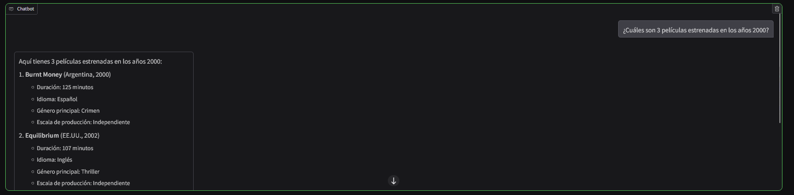
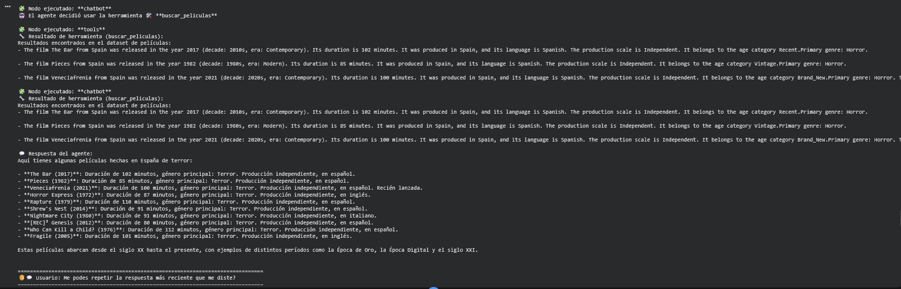
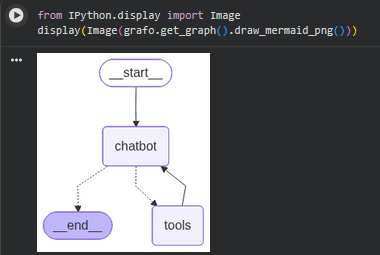

# Agentic RAG Chatbot for Movies and Research Papers

> An academic AI project that combines multi-source retrieval, tool calling, conversational memory, and graph-based orchestration in a single Python chatbot.

**Created by Joaquin Chifteian, Ana Clara Vázquez, and Martina Barone**


## Overview

This repository showcases an **Agentic Retrieval-Augmented Generation (RAG) chatbot** built in Python for an academic AI project. The system answers user questions by retrieving information from **two different knowledge sources**:

- a **structured movie dataset**
- a **collection of academic PDF papers**

Instead of relying on a single document store, the chatbot uses **tool-based routing** to decide which source to query, then generates a response grounded in retrieved content. The project combines **embeddings, vector search, graph-based agent flow, short-term memory, and a simple Gradio interface** into one end-to-end application.

From a portfolio perspective, this project demonstrates practical skills in:

- designing a multi-source RAG workflow
- integrating LLMs with external tools
- building vector search pipelines with Pinecone
- orchestrating agent behavior with LangGraph
- connecting backend AI logic to a usable frontend

## Problem It Solves

Many chatbot demos only work against a single source of information and do not show how retrieval changes when the data is heterogeneous. This project addresses that by building a chatbot that can answer questions across:

- **structured domain data** about movies
- **unstructured technical content** from academic papers

That makes the system more interesting than a standard RAG prototype because it has to:

- choose the right retrieval path for the question
- handle different data formats and chunking strategies
- preserve recent conversational context
- return responses grounded in retrieved evidence rather than generic model output

## How It Works

At a high level, the application follows an agentic RAG flow:

1. The user submits a question through the chat interface.
2. A LangGraph-based agent evaluates the request.
3. The agent decides whether to answer directly for small talk, query the **movie retrieval tool**, query the **academic papers retrieval tool**, or consult **short-term conversation memory**.
4. The selected tool performs vector search in Pinecone using Hugging Face embeddings.
5. The retrieved context is passed back to the LLM.
6. The chatbot generates a final grounded response in the conversation.

### Architecture Summary

- **Knowledge Source 1:** movie dataset transformed into LangChain documents with metadata
- **Knowledge Source 2:** academic PDFs loaded, preprocessed, chunked, and embedded
- **Embeddings:** `sentence-transformers/all-MiniLM-L6-v2`
- **Vector Database:** Pinecone indexes for movies and papers
- **LLM:** Hugging Face-hosted inference endpoint
- **Agent Orchestration:** LangGraph state graph with tool execution flow
- **Tool Calling:** retrieval tools for movies, papers, and recent memory
- **Memory:** short-term conversation memory storing recent interactions
- **UI:** Gradio chat interface

## Main Features

- **Agentic multi-source retrieval**
  The chatbot can reason over both a movie dataset and academic PDF papers instead of a single corpus.

- **Tool-based query routing**
  The system uses tool calling so the model can select the appropriate retrieval path based on the user request.

- **Separate vector indexes**
  Movies and papers are stored in distinct Pinecone indexes, making the retrieval pipeline easier to reason about and extend.

- **Metadata-aware movie retrieval**
  Movie documents preserve fields such as title, year, decade, genre, country, language, runtime, and production-related attributes.

- **PDF ingestion and preprocessing**
  The project loads academic papers, normalizes text, expands abbreviations, and chunks content for semantic retrieval.

- **Short-term conversational memory**
  The chatbot keeps recent interactions available so it can answer follow-up questions and recall recent context.

- **Graph-based agent flow**
  LangGraph is used to define nodes, tool execution, and routing logic in a structured way.

- **Interactive Gradio interface**
  A lightweight frontend makes it easy to test the chatbot end to end.

## Tech Stack

| Area | Tools / Libraries |
|---|---|
| Language | Python |
| LLM access | Hugging Face Inference Endpoint |
| Embeddings | Hugging Face `sentence-transformers/all-MiniLM-L6-v2` |
| RAG framework | LangChain |
| Agent orchestration | LangGraph |
| Vector database | Pinecone |
| Document loading | PyPDF |
| Text preprocessing | spaCy, regex-based normalization |
| Data handling | pandas |
| UI | Gradio |
| Notebook environment | Google Colab / Jupyter-style workflow |

## Project Structure

This repository is currently organized around the academic notebook implementation:

```text
.
├── docs/
│   └── screenshots/
│       ├── architecture.png
│       ├── chat-ui.png
│       └── response-flow.png
├── Documentación.pdf
├── README.md
├── Solución.ipynb
```

### Notes on the current structure

- [`Solución.ipynb`](./Solución.ipynb) contains the full implementation, including dependency setup, dataset and PDF ingestion, chunking and embeddings, Pinecone indexing, tool definitions, LangGraph workflow, memory logic, and the Gradio interface.
- [`Documentación.pdf`](./Documentación.pdf) contains the academic project documentation.

## Screenshots

### Chat interface


### Example response flow


### Retrieval / architecture view


## Setup / Installation

### Prerequisites

- Python 3.x
- A **Hugging Face API token**
- A **Pinecone API key**
- Access to the movie dataset CSV
- Access to the academic PDF files used in the project

### Install dependencies

The notebook installs its dependencies inline. Based on the implementation, the main packages used are:

```bash
pip install numpy==1.26.4
pip install sentence-transformers --upgrade
pip install langchain langchain-community langchain-pinecone pinecone-client pandas langchain-huggingface huggingface_hub tqdm pypdf langgraph
pip install spacy gradio
```

If you run the PDF preprocessing locally, you may also need the spaCy English model:

```bash
python -m spacy download en_core_web_sm
```

### Configure credentials

The current notebook version is designed around **Google Colab secrets / userdata** and uses:

- `HF_TOKEN`
- `PINECONE_API_KEY`

It also sets:

```bash
HUGGINGFACEHUB_API_TOKEN=<your_hf_token>
PINECONE_API_KEY=<your_pinecone_key>
```

### Prepare data sources

The implementation expects:

- a movie CSV dataset
- a folder containing the academic PDF papers

If you run the notebook outside the original Colab/Drive setup, update the file paths in [`Solución.ipynb`](./Solución.ipynb) to match your local environment.

## How to Run

### Option 1: Run in Google Colab

This is the most natural way to run the current version of the project because the notebook is written for Colab and Google Drive integration.

1. Open [`Solución.ipynb`](./Solución.ipynb) in Colab.
2. Configure `HF_TOKEN` and `PINECONE_API_KEY` in Colab secrets.
3. Mount Google Drive if your dataset and PDFs are stored there.
4. Run the notebook cells in order.
5. Build or connect to the Pinecone indexes.
6. Launch the Gradio interface from the final section of the notebook.

### Option 2: Run locally with Jupyter

1. Open the notebook in Jupyter.
2. Install the required dependencies.
3. Replace Colab-specific secret handling with local environment variables.
4. Update dataset and PDF paths.
5. Run the notebook sequentially.

## Example Use Cases

- Ask for movie recommendations or examples filtered by metadata such as decade, genre, country, or language.
- Query academic papers for explanations of concepts like embeddings, RAG, self-attention, or transformer architectures.
- Switch between entertainment-domain questions and technical AI questions in the same conversation.
- Ask follow-up questions that rely on recent chat context.
- Inspect how an agent chooses tools and combines retrieval with generation.

## Limitations

- This is an **academic prototype**, not a production-deployed application.
- The implementation currently lives primarily in a notebook rather than a modular Python package.
- Data paths and credential management are tied to a Colab-style workflow in the current version.
- Retrieval quality depends on the source data, chunking strategy, and embedding model.
- Short-term memory is intentionally lightweight and limited to recent interactions.
- The project uses external services, so usage depends on valid API credentials and service availability.

## Key Takeaways

This project was valuable because it moved beyond a basic chatbot and required coordinating several practical AI engineering components in one system:

- building a retrieval pipeline for both structured and unstructured knowledge
- designing tool interfaces that the LLM can use effectively
- using LangGraph to make agent behavior explicit and inspectable
- working with embeddings and vector databases in a real application flow
- thinking about conversation state, not just single-turn prompts
- connecting backend AI logic to a user-facing interface

## Future Improvements

- Refactor the notebook into a cleaner multi-file Python application
- Add source citations in final answers for better traceability
- Introduce evaluation workflows for retrieval quality and response accuracy
- Expand memory from short-term session state to a more robust persistence layer
- Improve observability around tool selection and graph execution
- Add configuration files and environment templates for easier setup
- Package the UI and backend more cleanly for local reproducibility

## Academic Context

This repository was developed as part of an academic artificial intelligence assignment. The goal was to design and implement a functional RAG-based assistant that demonstrates:

- document ingestion and preprocessing
- semantic search with embeddings
- vector storage and retrieval
- agent-based orchestration
- conversational interaction with memory

Although the project originated in an academic setting, it is presented here as a portfolio piece because it reflects hands-on work with modern LLM application patterns and practical AI tooling.

## Contact / Portfolio Note

This project represents my work on building an end-to-end AI assistant that combines **RAG, agent orchestration, tool calling, vector search, and UI integration** in a single system. If you are a recruiter, hiring manager, or developer reviewing this repository, the main value of the project is not just the final chatbot, but the engineering decisions behind how multiple AI components were connected into a coherent application.

If helpful, you can use this repository as a starting point to discuss:

- RAG architecture decisions
- multi-source retrieval design
- LangGraph agent workflows
- vector database integration
- practical tradeoffs in notebook-to-application development
